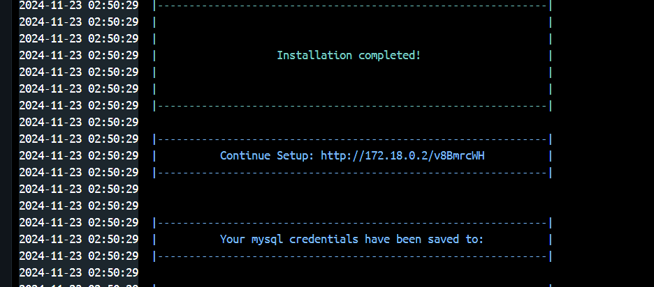

<!-- PROJECT LOGO -->
<br />
<p align="center">
  <a href="https://shahidmalla.com">
    
  </a>

  <h3 align="center">XUI Installer</h3>

  <p align="center">
    A one-click and containerized setup for XUI, by <a href="https://shahidmalla.com">Shahid Malla</a>.
    <br />
    <br />
    <a href="https://shahidmalla.com">Website</a>
    ·
    <a href="../../issues">Report Bug</a>
    ·
    <a href="../../issues">Request Feature</a>
  </p>
</p>

---

**Maintained by [Shahid Malla](https://shahidmalla.com)**
Website: **https://shahidmalla.com**

This repository provides a fully automated setup for **XUI**, a comprehensive IPTV panel used for capturing, delivering, and transcoding video content (enterprise video delivery, streaming, VOD, etc.). It includes:

- A **one-click install script** (`install.sh`) for a fresh Ubuntu server.
- A **Dockerized setup** (`compose.yml` + `dockerfile`) for containerized deployments.

---

## Table of Contents

- [What This Does](#what-this-does)
- [Requirements](#requirements)
- [Option A — One-Click Install (Ubuntu Server)](#option-a--one-click-install-ubuntu-server)
- [Option B — Docker Install](#option-b--docker-install)
- [After Installation](#after-installation)
- [Updating / Re-running](#updating--re-running)
- [Troubleshooting](#troubleshooting)
- [Project Structure](#project-structure)
- [Support](#support)
- [License](#license)

---

## What This Does

1. **Automated Setup** — Installs and configures `XUI 1.5.12` on `Ubuntu 20.04 / 22.04 / 24.04`.
2. **Dependency Management** — Installs everything XUI needs (MySQL/MariaDB, Python, unzip, etc).
3. **Persistent Storage** (Docker option) — Keeps your data safe across container restarts using Docker volumes.
4. **One Command Install** — No manual steps: run one line in your terminal and the panel is ready.

The installer downloads the XUI package from this repository's **GitHub Release** (not the old, dead third-party host), so the download link stays reliable and under your control.

---

## Requirements

- A fresh **Ubuntu 20.04, 22.04, or 24.04 (x86_64)** server, **or**
- **Docker** + **Docker Compose** if you prefer the containerized route: https://docs.docker.com/get-docker/
- `sudo` / root access on the target machine.

---

## Option A — One-Click Install (Ubuntu Server)

Run this single command on a fresh Ubuntu server (as root or a user with `sudo`):

```bash
wget https://raw.githubusercontent.com/shahidmallaofficial/xui-one-installer/main/install.sh -O install.sh && chmod +x install.sh && ./install.sh
```

What it does:

1. Detects your OS/version and confirms it's supported.
2. Installs required packages (Python, unzip, etc).
3. Downloads `XUI_1.5.12.zip` directly from this repo's [GitHub Releases](../../releases) and extracts it to `/root`.
4. Downloads and runs the setup script (`install.python3.py`), which finishes configuring MySQL and the XUI service.
5. Prints your access URL and MySQL credentials at the end — **save the `credentials.txt` file it mentions somewhere safe.**

> **Supported Ubuntu versions:**
>
> ✅ Ubuntu 20.04
> ✅ Ubuntu 22.04
> ✅ Ubuntu 24.04

---

## Option B — Docker Install

> **Note:** the Docker build expects a real `original_xui/xui.tar.gz` file. The copy that shipped with this repo's source was only a placeholder (an unresolved pointer, no actual data), so it has been left out of git — drop your own `xui.tar.gz` into `original_xui/` before building, or use **Option A** instead, which does not need it.

1. **Clone the repository:**

   ```bash
   git clone https://github.com/shahidmallaofficial/xui-one-installer.git
   cd xui-one-installer
   ```

2. **Build and run the container:**

   ```bash
   docker compose up -d
   ```

3. **Access XUI:** open the URL/port shown by `docker compose logs -f xui` in your browser.

   

Data is persisted in two Docker volumes:

- `xui_data` → XUI installation files (`/home/xui`)
- `mysql_data` → MySQL database files (`/var/lib/mysql`)

---

## After Installation

- The script prints a **Continue Setup** URL — open it in your browser to finish the panel setup wizard.
- Your **MySQL credentials** are saved to a `credentials.txt` file on the server — move it somewhere safe and then delete it from the server.
- Default web ports and service management are handled by XUI itself once installed.

---

## Updating / Re-running

- The one-click script is safe to re-run; it re-downloads the release package and re-runs setup.
- If you update the XUI package version, publish a new [GitHub Release](../../releases) with the new zip and update the `RELEASE_TAG` / `XUI_ZIP` variables at the top of `install.sh`.

---

## Troubleshooting

- **Docker option:** check logs with:

  ```bash
  docker compose logs
  ```

- **One-click script:** re-run with `bash -x install.sh` to see verbose output if a step fails.
- **Download fails:** confirm the [Release](../../releases) named in `install.sh` still exists and that the server has outbound internet access to GitHub.
- Still stuck? [Open an issue](../../issues) or reach out via **https://shahidmalla.com**.

---

## Project Structure

```
.
├── install.sh              # One-click installer (Ubuntu)
├── install.python3.py      # Core setup script run by install.sh
├── compose.yml              # Docker Compose config
├── dockerfile               # Docker image definition
├── original_xui/            # Base XUI files used by the Docker build
└── assets/                  # Logo & documentation images
```

---

## Support

Maintained by **Shahid Malla**
🌐 Website: **https://shahidmalla.com**
🐛 Issues / feature requests: [open an issue](../../issues) on this repo.

---

## License

This project is licensed under the [MIT License](./License). See the `License` file for details.
